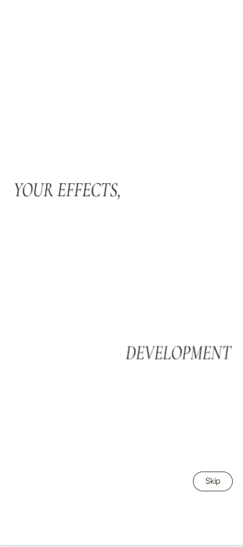
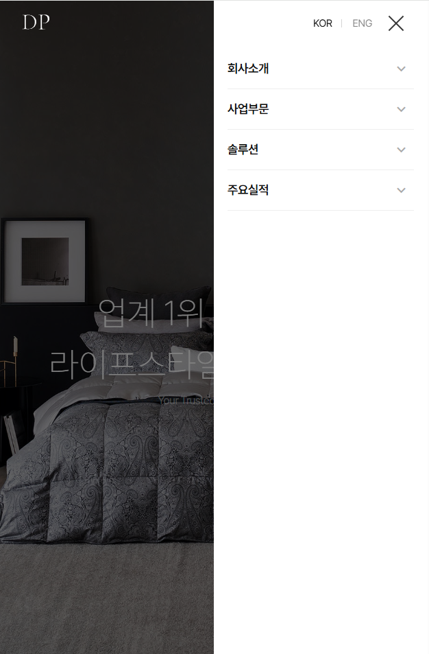
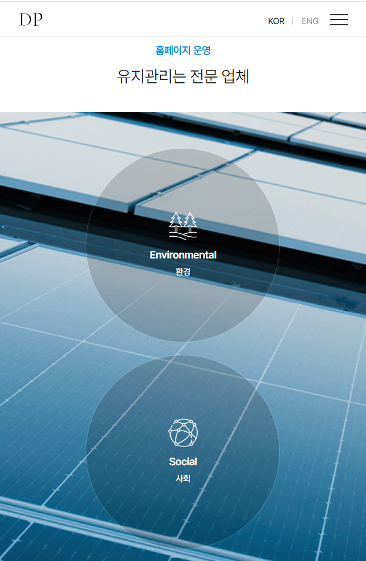

# DP-Project

</br>

### 🔍 주요특징

1. 매끄럽고 동적인 인트로 애니메이션
* GSAP의 timeline을 사용해 페이지 로딩 시<br>
  다양한 요소들이 정교하게 움직이며 시선을 사로잡는 인트로를 보여줍니다.

2. 스크롤 기반의 몰입감 있는 인터랙션 (스크롤텔링)
* ScrollTrigger의 pin과 scrub 기능으로 스크롤에 따라<br>
  콘텐츠가 고정되고 동적으로 변화하며 시각적인 스토리텔링을 제공합니다.

3. 부드럽고 고급스러운 스크롤 경험
* Lenis와 GSAP ScrollToPlugin을 활용하여 브라우저의 기본 스크롤을 대체,<br>
  매우 부드러운 스크롤 이동과 전체적인 고급스러움을 선사합니다.

4. 효율적이고 동적인 헤더 및 UI 요소
* 스크롤 방향 및 화면 크기에 반응하여 헤더와 메뉴가 동적으로 동작하며,<br>
  사용자 편의를 위한 "TOP" 버튼을 제공합니다.

5. 터치/슬라이드 인터랙션 (Swiper)
* Swiper 라이브러리를 통해 터치 기반의 슬라이더/캐러셀을 구현하여<br>
  콘텐츠 탐색을 용이하게 합니다.


</br>

### 🛠️ 사용 기술


      


</br>

### ⚙️ 기능 상세 설명

### 🎯 lenisAnimation 함수

- Lenis 라이브러리를 초기화하여 웹 페이지에 부드러운 스크롤 효과를 적용하며,
- requestAnimationFrame으로 부드러운 애니메이션 루프를 만듭니다.

 ``` JavaScript
function lenisAnimation(){
	const lenis = new Lenis({
		duration: 2,
		easing: (t) => Math.min(1, 1.001 - Math.pow(2, -10 * t))
	});

	function raf(time){
		lenis.raf(time);
		requestAnimationFrame(raf);
	}

	requestAnimationFrame(raf);
```

---

</br>

### 🎯 2. useEffect 훅 및 인트로 타임라인 초기화 
- 컴포넌트가 마운트될 때 실행되는 useEffect 훅 내에서,
- 인트로 애니메이션을 위한 GSAP 타임라인을 생성하고 6배 빠르게 재생합니다.
  
``` JavaScript
const introTl = gsap.timeline({ paused: true });

introTl.timeScale(6).play();
```
---

</br>

### 🎯  3. 모바일 인트로 애니메이션
- 뷰포트 너비가 969px 이하인 모바일 환경에서 .intro 섹션 내의 다양한 텍스트 및
- 이미지 요소에 대한 인트로 애니메이션 시퀀스를 정의합니다.



 ``` JavaScript
if (window.matchMedia("(max-width: 969px)").matches) { // mobile
introTl.to(".intro .title-t ", { y: 0, x: 0, duration: 4 })
.to(".intro .title-p ", { y: 0, x: 0, duration: 4 }, 0)
.to(".intro .hidden-t .basic ", { duration: 2 })
.to(".intro .hidden-t .color ", { alpha: 1, duration: 4, delay: -1 })
.to(".intro .hidden-t ", { alpha: 0, duration: 4, delay: 4 })
.to(".intro .hidden-t ", { width: "30px", duration: 5 })
.to(".intro .txt-t ", { alpha: 1, duration: 4, delay: -6 })
.to(".intro .txt-p ", { alpha: 1, duration: 4, delay: -6 })
.to(".intro .title-t ", { duration: 4, marginRight: 0, delay: -5 })
.to(".intro .title-p", { duration: 4, delay: -5 })
.to(":lang(ko) .intro .title-m", { alpha: 1 , width: "270px", duration: 4, delay: 5 })
.to(".intro", { top: "-100vh", duration: 5, delay: 8 });
```

---

</br>

### 🎯  4. 인트로 건너뛰기 기능
- .skip-btn a 요소 클릭 시 intro 섹션을 부드럽게 페이드 아웃시키고
-  DOM에서 제거하여 인트로를 건너뛸 수 있게 합니다.


 ``` JavaScript
let skipBtn = document.querySelector(".skip-btn a");
let intro = document.querySelector(".intro");

skipBtn.addEventListener("click", function(e){
	e.preventDefault();

	gsap.to(".intro", {opacity: 0, duration: 1, onComplete: function(){
		intro.style.display = "none";
	}});
});
```

---

</br>

</br>

### 📱 모바일 반응형 이미지

| 모바일 메인페이지 | 모바일 메뉴 | 모바일 콘텐츠 |
|------------------|------------|-------------|
|  |  |  |

</br>

### 🧾 View
https://dpproject-fawn.vercel.app/

